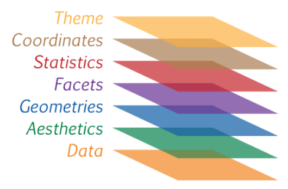

```{r setup, include=FALSE}
options(htmltools.dir.version = FALSE)
```

background-image: url("images/logo_semanistica_datathon2.png")

---

background-image: url("images/logo_40anos_ppgest2.png")

---

# Estatística e Ciência dos dados

```{r echo=FALSE, fig.align='center', message=FALSE, warning=FALSE, out.width='45%', paged.print=FALSE}

```

---

# Estatística e Ciência dos dados

```{r echo=FALSE, fig.align='center', message=FALSE, warning=FALSE, out.width='90%', paged.print=FALSE}

```

.footnote[
[**Fonte:** Efron, B. e Hastie, T. (2016). *Computer Age Statistical Inference: Algorithms, Evidence, and Data Science*. Cambridge: Cambridge University Press.](https://web.stanford.edu/~hastie/CASI_files/PDF/casi.pdf)
]

---


```{r echo=FALSE, fig.align='center', message=FALSE, warning=FALSE, out.width='76%', paged.print=FALSE}

```

---

class: inverse, middle, center
background-image: url("images/pintando_bordando_colmeia.png")
background-size: contain

---
class: inverse
background-image: url("images/vai_precisar.JPG")
background-size: contain

# Você vai precisar de ...

- [R](https://www.r-project.org)
- [RStudio](https://www.rstudio.com) é recomendável, mas não é necessário.
- Pacotes principais:
    + [ggplot2](https://ggplot2.tidyverse.org)
    + [rmarkdown](https://rmarkdown.rstudio.com)

- Pacotes auxiliares:
    + [knitr](https://yihui.name/knitr/)
    + [plyr](https://rmarkdown.rstudio.com/)
    + [gapminder](https://rmarkdown.rstudio.com/)

- Banco de dados:
    + **gapminder** do pacote `gapminder`
    

- **Arquivos de apoio:**
    + https://www.ufrgs.br/datathon

---

class: inverse, middle, center
background-image: url("images/hex-ggplot2.png")
background-size: contain

---

# O que é o ggplot2?

.pull-left[
```{r echo=FALSE, fig.align='center', message=FALSE, warning=FALSE, out.width='100%', paged.print=FALSE}
knitr::include_graphics('images/hadley1.jpg')
```

]

.pull-right[
- Implementação em **R** da **Gramática dos Gráficos** (*Grammar of the Graphics*; **gg**) de **Leland Wilkinson**<sup>1</sup> por **Hadley Wickham**<sup>2</sup>.

- **Pergunta:** que é um gráfico estatístico?
    + **gg:** é um mapeamento dos dados a partir de **atributos estéticos** (cores, formas, tamanho) de **formas geométricas** (pontos, linhas, barras)

]

.footnote[
[1] Wilkinson, L. (2005). *The Grammar of Graphics*. Springer; 2nd edition.

[2] Wickham, H. (2016). *ggplot2: Elegant Graphics for Data Analysis*. Springer; 2nd edition.
]

---

# Por que ggplot2?

.pull-left[

Um gráfico do pacote **graphics**

```{r echo=FALSE, fig.align='center', message=FALSE, warning=FALSE, out.width='100%', paged.print=FALSE}
plot(hp ~ mpg,
     data = mtcars,
     xlab = "Miles/(US) gallon",
     ylab = "Gross horsepower")
```

]

.pull-right[

Um gráfico do pacote **ggplot2**

```{r echo=FALSE, fig.align='center', message=FALSE, warning=FALSE, out.width='100%', paged.print=FALSE}
library(ggplot2)
p <- ggplot(data = mtcars,
            mapping = aes(x = mpg, y = hp))
p + geom_point() +
  labs(x = "Miles/(US) gallon", y = "Gross horsepower")
```

]

---

# Por que ggplot2?

.pull-left[

Um gráfico do pacote **graphics**

```{r echo=FALSE, fig.align='center', message=FALSE, warning=FALSE, out.width='100%', paged.print=FALSE}
plot(hp ~ mpg,
     data = mtcars,
     xlab = "Miles/(US) gallon",
     ylab = "Gross horsepower")
```

]

.pull-right[

Um gráfico do pacote **ggplot2**

```{r echo=FALSE, fig.align='center', message=FALSE, warning=FALSE, out.width='100%', paged.print=FALSE}
library(ggplot2)
mtcars$am <- factor(mtcars$am, labels = c("Automatic", "Manual"))
cbPalette <- c("#29BF12", "#FFBF00")
p <- ggplot(data = mtcars,
            mapping = aes(x = mpg, y = hp, color = am))
p + geom_point(size = 2) +
  labs(x = "Miles/(US) gallon", y = "Gross horsepower", color = "Transmission") +
  theme_dark() + theme(legend.position = "top") +
  scale_colour_manual(values = cbPalette)
```

]

---

# Camadas!

- No **ggplot2**, um gráfico é feito por camadas.

```{r echo=FALSE, fig.align='center', message=FALSE, warning=FALSE, out.width='70%', paged.print=FALSE}

```

---

background-image:  url("images/totoro_danca2.gif")
background-size: cover
class: center, inverse

# Vamos lá!

---

# Instalando e carregando o ggplot2

- Instalando o pacote **ggplot2**

```{r echo=TRUE, eval=FALSE, message=FALSE, warning=FALSE}
install.packages("ggplot2")
```

- Carregando o pacote **ggplot2**

```{r echo=TRUE, eval=FALSE, message=FALSE, warning=FALSE}
library(ggplot2)
```

---

# O banco de dados

- Carregando o banco de dados **gapminder**

```{r echo=TRUE, message=FALSE, warning=FALSE}
# install.packages("gapminder")
library(gapminder)
gapminder
```

---

# O banco de dados

- `gdpPercap`: **renda per capita** ("PIB/Pop").
- `lifeExp`: **expectativa de vida** ao nascer (número de anos aproximados que se espera que um grupo de indivíduos nascidos no mesmo ano irá viver).
- `year`: 1952 a 2007 em incrementos de 5 anos.

```{r echo=TRUE, message=FALSE, warning=FALSE}
library(dplyr)
gapminder <- gapminder %>%
  mutate(pop_m = pop/1e6)

gapminder07 <- gapminder %>%
  filter(year == 2007)
```

---

# Camadas: dados

```{r echo=TRUE, message=FALSE, warning=FALSE, fig.align='center', out.width="50%"}
p <- ggplot(data = gapminder07)
p
# print(p)
```

---

background-image:  url("images/tenor.gif")
background-size: cover
class: center, inverse

# Camadas: estética

---

# Camadas: elementos estéticos

```{r echo=TRUE, message=FALSE, warning=FALSE, fig.align='center', out.width="50%"}
p <- ggplot(data = gapminder07,
            mapping = aes(x = gdpPercap, y = lifeExp))
p
```

---

# Camadas: elementos estéticos

- Os dois elementos estéticos mais importantes são os eixos `x` e `y` do gráfico.
- Existem outros elementos estéticos **(mais variáveis podem ser incorporadas ao gráfico)** que devem ser especificados de acordo com o tipo de gráfico.
    + `color` ou `colour`
    + `fill`
    + `size`
    + `group`
- Veremos a utilização destes elementos na sequência.

---

# Camadas: elementos geométricos

```{r echo=TRUE, message=FALSE, warning=FALSE, fig.align='center', out.width="50%"}
p <- ggplot(data = gapminder07,
            mapping = aes(x = gdpPercap, y = lifeExp)) +
  geom_point() #<<
p
```

---

# Camadas: elementos geométricos

- O gráfico anterior é um **diagrama de dispersão** (*scatter plot*) e é definido pela função `geom_point()`.
    + Este é acrescentado ao gráfico com o **operador** `+`.
- Diferentes elementos geométricos definem diferentes tipos de gráficos. Os principais são listadas a seguir:
    + `geom_histogram()`: gera um histograma
    + `geom_line()`: gera um gráfico de linha
    + `geom_boxplot()`: gera um diagrama de caixa (boxplot)
    + `geom_bar()`: gera um gráfico de barras/colunas
    + `geom_density()`: gera um gráfico da densidade estimada (por *kernel*)
    + `geom_violin()`: gera um gráfico de violino (mistura de boxplot com densidade estimada)
- Para uma lista completa de `geoms` veja: https://ggplot2.tidyverse.org/reference/index.html#section-layer-geoms.
- **Elementos estéticos** (`aes()`) podem ser passados para cada `geom`.

---

background-image:  url("images/totoro_bambole.gif")
background-size: cover
class: center, inverse

# Exemplos!

---

```{r echo=TRUE, message=FALSE, warning=FALSE, fig.align='center', out.width="60%"}
# Histograma
p <- ggplot(data = gapminder07,
            mapping = aes(x = lifeExp)) +
  geom_histogram()
p
```

---

```{r echo=TRUE, message=FALSE, warning=FALSE, fig.align='center', out.width="60%"}
# Densidade estimada
p <- ggplot(data = gapminder07,
            mapping = aes(x = lifeExp)) +
  geom_density()
p
```

---

```{r echo=TRUE, message=FALSE, warning=FALSE, fig.align='center', out.width="60%"}
# Densidade estimada (grupos)
p <- ggplot(data = gapminder07,
            mapping = aes(x = lifeExp, fill = continent)) +
  geom_density(alpha = 0.3)
p
```

---

```{r echo=TRUE, message=FALSE, warning=FALSE, fig.align='center', out.width="60%"}
# Gráfico de barras
p <- ggplot(data = gapminder07,
            mapping = aes(x = continent)) +
  geom_bar()
p
```

---

```{r echo=TRUE, message=FALSE, warning=FALSE, fig.align='center', out.width="60%"}
# Boxplot
p <- ggplot(data = gapminder07,
            mapping = aes(x = continent, y = pop_m)) +
  geom_boxplot()
p
```

---

```{r echo=TRUE, message=FALSE, warning=FALSE, fig.align='center', out.width="60%"}
# Gráfico de violino
p <- ggplot(data = gapminder07,
            mapping = aes(x = continent, y = pop_m)) +
  geom_violin()
p
```

---

```{r echo=TRUE, message=FALSE, warning=FALSE, fig.align='center', out.width="60%"}
# Gráfico de linha
p <- ggplot(data = gapminder[which(gapminder$country == "Brazil"),],
            mapping = aes(x = year, y = lifeExp)) +
  geom_line(size = 1)
p
```

---

```{r echo=TRUE, message=FALSE, warning=FALSE, fig.align='center', out.width="62%"}
# Gráfico de linha
p <- ggplot(data = gapminder[which(gapminder$continent == "Americas"),],
            mapping = aes(x = factor(year), y = lifeExp, group = country, color = country)) +
  geom_line(size = 1) + geom_point()
p
```

---

background-image:  url("images/totoro_corda.gif")
background-size: cover
class: center, inverse

# Exercício 1

---

- Acrescente as variáveis continente (`continent`) e população (`pop` ou `pop_m`) ao gráfico abaixo.

```{r echo=FALSE, message=FALSE, warning=FALSE, fig.align='center', out.width="60%"}
p <- ggplot(data = gapminder07,
            mapping = aes(x = gdpPercap, y = lifeExp)) +
  geom_point()
p
```

---

```{r echo=TRUE, message=FALSE, warning=FALSE, fig.align='center', out.width="65%"}
p <- ggplot(data = gapminder07,
            mapping = aes(x = gdpPercap, y = lifeExp, color = continent, size = pop_m)) +
  geom_point(alpha = 0.3) + geom_text(aes(label = country), color = "gray20")
p
```

---

```{r echo=TRUE, message=FALSE, warning=FALSE, fig.align='center', out.width="65%"}
p + geom_smooth(method = "lm")
```

---

```{r echo=TRUE, message=FALSE, warning=FALSE, fig.align='center', out.width="65%"}
p + geom_smooth(mapping = aes(x = gdpPercap, y = lifeExp, color = NULL), method = "lm")
```

---

```{r echo=TRUE, message=FALSE, warning=FALSE, fig.align='center', out.width="65%"}
p + geom_smooth(mapping = aes(x = gdpPercap, y = lifeExp, color = NULL), method = "lm", formula = y ~ x + log(x), se = FALSE, color = "red")
```

---

# Camadas: facetas

```{r echo=TRUE, message=FALSE, warning=FALSE, fig.align='center', out.width="50%"}
p <- ggplot(data = gapminder,
            mapping = aes(x = gdpPercap, y = lifeExp)) +
  geom_point() + 
  facet_grid(. ~ year) #<<
p
```

---

# Camadas: facetas

```{r echo=TRUE, message=FALSE, warning=FALSE, fig.align='center', out.width="50%"}
p <- ggplot(data = gapminder,
            mapping = aes(x = gdpPercap, y = lifeExp, color = continent)) +
  geom_point() + 
  facet_wrap(. ~ year) #<<
p
```

---

# Camadas: facetas

```{r echo=TRUE, eval=FALSE, message=FALSE, warning=FALSE, fig.align='center', out.width="50%"}
gapminder$gdpPercap.cat <- cut(gapminder$gdpPercap,
                               breaks = c(0, 1005, 3955,
                                          12235, Inf),
                               labels = c("Baixa-renda", 
                                          "Renda média-baixa",
                                          "Renda média-alta",
                                          "Renda alta"))
p <- ggplot(data = gapminder,
            mapping = aes(x = factor(year),
                          y = lifeExp, fill = factor(year))) +
  geom_boxplot() + 
  facet_grid(continent ~ gdpPercap.cat) #<<
p
```

---

# Camadas: facetas

```{r echo=FALSE, eval=TRUE, message=FALSE, warning=FALSE, fig.align='center', out.width="70%"}
gapminder$gdpPercap.cat <- cut(gapminder$gdpPercap,
                               breaks = c(0, 1005, 3955, 12235, Inf),
                               labels = c("Baixa-renda", "Renda média-baixa", "Renda média-alta", "Renda alta"))
p <- ggplot(data = gapminder,
            mapping = aes(x = factor(year), y = lifeExp, fill = factor(year))) +
  geom_boxplot() + 
  facet_grid(continent ~ gdpPercap.cat) #<<
p
```

---

# Eixos e rótulos

```{r echo=TRUE, message=FALSE, warning=FALSE, fig.align='center', out.width="60%"}
p <- ggplot(data = gapminder07,
            mapping = aes(x = gdpPercap, y = lifeExp,
                          color = continent, size = pop_m)) +
  geom_point(alpha = 0.3)
p
```

---

# Eixos e rótulos

```{r echo=TRUE, message=FALSE, warning=FALSE, fig.align='center', out.width="60%"}
p + labs(x = "Renda per capita (US$)",
         y = "Expectativa de vida (anos)",
         color = "Continente", size = "População/1 milhão")
```

---

# Legendas e temas

.pull-left[

```{r echo=FALSE, results='hide', fig.align='center', message=FALSE, warning=FALSE, out.width='100%', paged.print=FALSE}
p <- p + labs(x = "Renda per capita (US$)",
         y = "Expectativa de vida (anos)",
         color = "Continente", size = "População/1 milhão")
```

```{r echo=TRUE, message=FALSE, warning=FALSE, fig.align='center', out.width="100%"}
p + theme(legend.position = "none")
```

]

.pull-right[

```{r echo=TRUE, message=FALSE, warning=FALSE, fig.align='center', out.width="100%"}
p + theme(legend.position = "top")
```

]

---

# Temas

- Existem diversos outros elementos do tema de um gráfico que podem ser controlados por argumentos da função `theme()`.

```{r echo=TRUE, eval=FALSE, message=FALSE, warning=FALSE, fig.align='center', out.width="50%"}
p + theme(text = element_text(color = "gray20"),
        legend.position = c("top"), # posição da legenda
        legend.direction = "horizontal",
        legend.justification = 0.1, # ponto de ancora para legend.position.
        legend.text = element_text(size = 11, color = "gray10"),
        axis.text = element_text(face = "italic"),
        axis.title.x = element_text(vjust = -1),
        axis.title.y = element_text(vjust = 2), 
        axis.ticks.y = element_blank(), # element_blank() é como removemos elementos
        axis.line = element_line(color = "gray40", size = 0.5),
        axis.line.y = element_blank(),
        panel.grid.major = element_line(color = "gray50", size = 0.5),
        panel.grid.major.x = element_blank())
```

---

# Temas

```{r echo=FALSE, eval=TRUE, message=FALSE, warning=FALSE, fig.align='center', out.width="70%"}
p + theme(text = element_text(color = "gray20"),
        legend.position = c("top"), # posição da legenda
        legend.direction = "horizontal",
        legend.justification = 0.1, # ponto de ancora para legend.position.
        legend.text = element_text(size = 11, color = "gray10"),
        axis.text = element_text(face = "italic"),
        axis.title.x = element_text(vjust = -1),
        axis.title.y = element_text(vjust = 2), 
        axis.ticks.y = element_blank(), # element_blank() é como removemos elementos
        axis.line = element_line(color = "gray40", size = 0.5),
        axis.line.y = element_blank(),
        panel.grid.major = element_line(color = "gray50", size = 0.5),
        panel.grid.major.x = element_blank())
```

---

background-image: url("images/ufa-homer-1.jpg")
background-size: cover

# Temas pré-definidos

- O pacote **ggplot2** possui alguns temas pré-definidos! Alguns exemplos são:
    + `theme_bw()`: *black and white*
    + `theme_minimal()`: mínimo
    + `theme_classic()`: semelhante aos gráficos do pacote **graphics**
    + `theme_dark()`: escuro

---

# Temas pré-dfinidos

```{r echo=TRUE, eval=TRUE, message=FALSE, warning=FALSE, fig.align='center', out.width="60%"}
p + theme_bw()
```

---

# Temas pré-definidos II: o pacote ggthemes

.pull-left[

```{r echo=FALSE, fig.align='center', message=FALSE, warning=FALSE, out.width='100%', paged.print=FALSE}

```

]

.pull-right[

- O pacote [**ggthemes**](https://yutannihilation.github.io/allYourFigureAreBelongToUs/ggthemes/) possui uma série de outros temas pré-definidos! 

```{r echo=TRUE, message=FALSE, warning=FALSE}
# install.packages("ggthemes")
library(ggthemes)
```

]

---

# Temas pré-dfinidos II: ggthemes

.pull-left[

```{r echo=TRUE, eval=TRUE, message=FALSE, warning=FALSE, fig.align='center', out.width="100%"}
# Wall Street Journal
p + theme_wsj()
```

]

.pull-right[

```{r echo=TRUE, eval=TRUE, message=FALSE, warning=FALSE, fig.align='center', out.width="100%"}
# The Economist
p + theme_economist()
```

]

---

# ggplot: um resumo esquemático

```{r echo=FALSE, fig.align='center', message=FALSE, warning=FALSE, out.width='100%', paged.print=FALSE}
knitr::include_graphics('images/ggplot-formula-schematic.png')
```

---

# Salvando um gráfico

.pull-left[

- Você pode salvar o último gráfico realizado com a função `ggsave()`

```{r echo=TRUE, eval=FALSE, message=FALSE, warning=FALSE}
ggsave("MeuPrimeiroGGPLOT.pdf")
ggsave("MeuPrimeiroGGPLOT.png")
ggsave("MeuPrimeiroGGPLOT.jpg",
       width = 4, height = 4)
```

]

.pull-right[

- Ou ainda, utilizando as funcionalidades do RStudio

```{r echo=FALSE, fig.align='center', message=FALSE, warning=FALSE, out.width='100%', paged.print=FALSE}

```

]

---

# Considerações finais

- Existem diversos pacotes que foram criados para complementar o **ggplot2**.
    + **ggthemes**
    + **grid**
    + **magick**
    + **plotly**
    + **jcolors**
- Juntos, estes pacotes tem um potencial quase ilimitado para a geração de gráficos no **R**.

---

```{r echo=TRUE, results='hide', fig.align='center', message=FALSE, warning=FALSE, out.width='100%', paged.print=FALSE}
# Considerações finais: exemplos
# install.packages("jpeg")
# install.packages("grid")
library(jpeg)
library(grid)
img <- readJPEG("~/PintandoEBordando/ArquivosR/images/hans_rosling.jpg")
# start plotting
p <- ggplot(data = gapminder07,
            mapping = aes(x = gdpPercap, y = lifeExp,
                          color = continent, size = pop_m)) + 
  annotation_custom(rasterGrob(img, width = unit(1, "npc"),
                               height = unit(1, "npc")),
                    -Inf, Inf, -Inf, Inf) +
  scale_y_continuous(expand = c(0,0), 
                     limits = c(min(gapminder07$lifeExp) * 0.9, max(gapminder07$lifeExp) * 1.05)) +
  geom_point() +
  labs(x = "Renda per capita (US$)",
       y = "Expectativa de vida (anos)",
       color = "Continente", size = "População/1 milhão") +
  theme_bw() +
  theme(text = element_text(color = "gray20"),
        legend.position = c("top"), # posição da legenda
        legend.direction = "horizontal",
        legend.justification = 0.1, # ponto de ancora para legend.position.
        legend.text = element_text(size = 11, color = "gray10"),
        axis.text = element_text(face = "italic"),
        axis.title.x = element_text(vjust = -1),
        axis.title.y = element_text(vjust = 2), 
        axis.ticks.y = element_blank(), # element_blank() é como removemos elementos
        axis.line = element_line(color = "gray40", size = 0.5),
        axis.line.y = element_blank(),
        panel.grid.major = element_line(color = "gray50", size = 0.5),
        panel.grid.major.x = element_blank()
  )
p

```

---

```{r echo=FALSE, fig.align='center', message=FALSE, warning=FALSE, out.width='70%', paged.print=FALSE}
# Considerações finais: exemplos
# install.packages("jpeg")
# install.packages("grid")
library(jpeg)
library(grid)
img <- readJPEG("~/PintandoEBordando/ArquivosR/images/hans_rosling.jpg")
# start plotting
p <- ggplot(data = gapminder07,
            mapping = aes(x = gdpPercap, y = lifeExp,
                          color = continent, size = pop_m)) + 
  annotation_custom(rasterGrob(img, width = unit(1, "npc"),
                               height = unit(1, "npc")),
                    -Inf, Inf, -Inf, Inf) +
  scale_y_continuous(expand = c(0,0), 
                     limits = c(min(gapminder07$lifeExp) * 0.9, max(gapminder07$lifeExp) * 1.05)) +
  geom_point() +
  labs(x = "Renda per capita (US$)",
       y = "Expectativa de vida (anos)",
       color = "Continente", size = "População/1 milhão") +
  theme_bw() +
  theme(text = element_text(color = "gray20"),
        legend.position = c("top"), # posição da legenda
        legend.direction = "horizontal",
        legend.justification = 0.1, # ponto de ancora para legend.position.
        legend.text = element_text(size = 11, color = "gray10"),
        axis.text = element_text(face = "italic"),
        axis.title.x = element_text(vjust = -1),
        axis.title.y = element_text(vjust = 2), 
        axis.ticks.y = element_blank(), # element_blank() é como removemos elementos
        axis.line = element_line(color = "gray40", size = 0.5),
        axis.line.y = element_blank(),
        panel.grid.major = element_line(color = "gray50", size = 0.5),
        panel.grid.major.x = element_blank()
  )
p

```

---

```{r echo=TRUE, fig.align='center', message=FALSE, warning=FALSE, out.width='60%', paged.print=FALSE}
# Considerações finais: exemplos - interatividade
p <- ggplot(data = gapminder07, mapping = aes(x = gdpPercap, y = lifeExp,
                          color = continent, size = pop_m)) + 
  geom_point() + labs(x = "Renda per capita (US$)", y = "Expectativa de vida (anos)",
       color = "Continente", size = "População/1 milhão") +  theme_bw()
p
```

---

```{r echo=TRUE, fig.align='center', message=FALSE, warning=FALSE, out.width='100%', paged.print=FALSE}
# Considerações finais: exemplos - interatividade
# install.packages("plotly")
library(plotly)
ggplotly(p)
```

---

background-image:  url("images/porquecomprar-v2.gif")
background-size: cover
class: center, middle, inverse

# Perguntas!?!

---

class: inverse, middle, center
background-image: url("images/rmarkdown.png")
background-size: contain

---

# O que é o rmarkdown<sup>1</sup>?

.pull-left[

```{r echo=FALSE, fig.align='center', message=FALSE, warning=FALSE, out.width='100%', paged.print=FALSE}

```

]

.pull-right[

```{r echo=FALSE, fig.align='center', message=FALSE, warning=FALSE, out.width='40%', paged.print=FALSE}
knitr::include_graphics('images/rstudio-hex-knitr-dot-psd.png')
```

- **R** (códigos) + **Markdown** (linguagem **simples** de marcação para geração de **texto**)
    + [**Pandoc**](http://pandoc.org/) (conversor universal de documentos)

]

.footnote[
[1] Allaire, J.J., Xie, Y., McPherson, J., Luraschi, J., Ushey, K., Atkins, A., Wickham, H., Cheng, J. e Chang, W. (2018). *rmarkdown: Dynamic
  Documents for R*. R package version 1.10.
]

---

background-image: url("images/bandThree2.png")
background-size: cover

# O fluxo do rmarkdown?

```{r echo=FALSE, fig.align='center', message=FALSE, warning=FALSE, out.width='100%', paged.print=FALSE}
knitr::include_graphics('images/rmarkdownflow.png')
```

- Quando compilado, o **R Markdown** alimenta o arquivo .Rmd para **knitr**, que executa todos os fragmentos de código e cria um novo documento markdown (.md) que inclui o código e sua saída.
- O arquivo markdown gerado pelo **knitr** é então processado pelo **pandoc**⧉ que é responsável pela criação do formato final.
- Isso pode parecer complicado, mas o **R Markdown** torna extremamente simples encapsulando todo o processamento acima em uma única função de renderização.

---

# Por que rmarkdown?

```{r echo=FALSE, fig.align='center', message=FALSE, warning=FALSE, out.width='100%', paged.print=FALSE}

```

- Vamos a um exemplo!

---

background-image:  url("images/totoro_danca.gif")
background-size: cover
class: center, inverse

# Vamos lá!

---

# Instalando e carregando o rmarkdown

- Instalando o pacote **rmarkdown**

```{r echo=TRUE, eval=FALSE, message=FALSE, warning=FALSE}
install.packages("rmarkdown")
```

- Carregando o pacote **rmarkdown**

```{r echo=TRUE, eval=FALSE, message=FALSE, warning=FALSE}
library(rmarkdown)
```

---

# Criando um documento R markdown

- Clique em `File -> New File -> R Markdown`

```{r echo=FALSE, fig.align='center', message=FALSE, warning=FALSE, out.width='55%', paged.print=FALSE}

```

---

# Criando um documento R markdown

- Agora você deve ver uma caixa de diálogo como mostrado abaixo.
- Selecione "Document" no painel à esquerda e preencha o campo de título e autor e clique em "OK".

```{r echo=FALSE, fig.align='center', message=FALSE, warning=FALSE, out.width='60%', paged.print=FALSE}
knitr::include_graphics('images/rmd_print_2.png')
```

---

# Criando um documento R markdown

- Agora você deve ter um documento que parece com isso

```{r echo=FALSE, fig.align='center', message=FALSE, warning=FALSE, out.width='100%', paged.print=FALSE}

```

---

# YAML

- Um conjunto de opções que definem o arquivo de saída

.pull-left[

- Este documento gera um arquivo `html`

```yaml
---
title: "Exemplo 1 - Rmd"
author: "Rodrigo Citton P. dos Reis"
date: "15 de outubro de 2018"
output: html_document
---
```

]

.pull-right[

- Este documento gera um arquivo `word`

```yaml
---
title: "Exemplo 1 - Rmd"
author: "Rodrigo Citton P. dos Reis"
date: "15 de outubro de 2018"
output: word_document
---
```

]

---

# Markdown: sintaxe básica

.pull-left[

```
texto simples
_italico_
__negrito__
[Datahon](https://www.ufrgs.br/datathon)

# Título 1

## Título 2

### Título 3
```

]

.pull-right[

texto simples

_italico_

__negrito__

[Datahon](https://www.ufrgs.br/datathon)

## Título 1

### Título 2

#### Título 3

]

---

# Markdown: sintaxe básica

.pull-left[

```

- Lista não ordenada
- item 2
    + sub-item 1
    + sub-item 2

1. Lista ordenada
2. item 2
    + sub-item 1
    + sub-item 2

Cabeçalho tabela | Segundo cabeçalho
---------------- | -----------------
Célula tabela    | Célula 2
Célula 3         | Célula 4
```

]

.pull-right[

- Lista não ordenada
- item 2
    + sub-item 1
    + sub-item 2
    
1. Lista ordenada
2. item 2
    + sub-item 1
    + sub-item 2

Cabeçalho tabela | Segundo cabeçalho
---------------- | -----------------
Célula tabela    | Célula 2
Célula 3         | Célula 4

]

---

background-image:  url("images/chuky.gif")
background-size: cover
class: center, inverse

# Chunk!

---

# Chunk

- Os códigos em **R** são passados para o arquivo .Rmd por meio de fragmentos de código (_chunk codes_).
- Um exemplo de chunk:


    `r ''````{r}
    summary(gapminder07$pop_m)
    ```
- Saída:

```{r}
summary(gapminder07$pop_m)
```

---

# Chunk

    `r ''````{r, echo=FALSE}
    summary(gapminder07$pop_m)
    ```

- Saída:
```{r, echo=FALSE}
summary(gapminder07$pop_m)
```

---

# Chunk

    `r ''````{r, eval=FALSE}
    summary(gapminder07$pop_m)
    ```

- Saída:
```{r, eval=FALSE}
summary(gapminder07$pop_m)
```

---

# Chunk

    `r ''````{r, echo=FALSE, results='asis'}
    library(knitr)
    mod1 <- lm(lifeExp ~ gdpPercap, data = gapminder07)
    kable(summary(mod1)$coef, format = "html")
    ```

- Saída:
```{r, echo=FALSE, results='asis'}
library(knitr)
mod1 <- lm(lifeExp ~ gdpPercap, data = gapminder07)
kable(summary(mod1)$coef, format = "html")
```

---

background-image:  url("images/totoro_jumpingjack.gif")
background-size: cover
class: center, inverse

# Exercício 1!

---

1. Crie um arquivo .Rmd.
2. Acrescente texto e a análise do arquivo **exemplo-rmarkdown-1.R**
3. Clique em `knit` para gerar o arquivo de saída.

```{r echo=FALSE, fig.align='center', message=FALSE, warning=FALSE, out.width='100%', paged.print=FALSE}

```

- Experimente gerar diferentes formatos de saída.

```{r echo=FALSE, fig.align='center', message=FALSE, warning=FALSE, out.width='100%', paged.print=FALSE}

```

---

# Por que rmarkdown?

```{r echo=FALSE, fig.align='center', message=FALSE, warning=FALSE, out.width='100%', paged.print=FALSE}

```

- Reprodutibilidade
- Dinamismo
- Eficiência
- Velocidade

---

background-image:  url("images/totoro_bola.gif")
background-size: cover
class: center, inverse

# Um último exemplo!

---

background-image:  url("images/porquecomprar-v2.gif")
background-size: cover
class: center, middle, inverse

# Perguntas!?!

---

background-image:  url("images/stat_caco.gif")
background-size: cover
class: middle, center, inverse

# Muito obrigado!

## https://www.ufrgs.br/datathon

### rodrigocpdosreis@gmail.com

